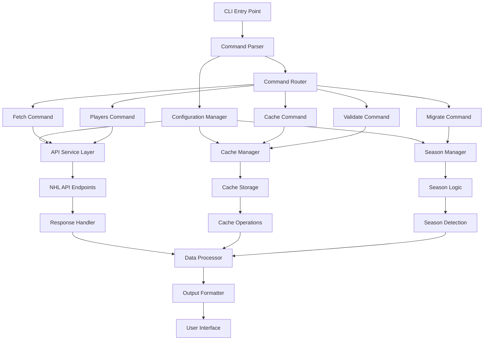

# CLI 2025 NHL Data Collection Fix - Comprehensive Documentation

## Executive Summary

The Finnish NHL Player Tracker project faces significant challenges with its CLI tools for 2025 NHL data collection. The current implementation suffers from fragmented approaches, inconsistent API endpoints, hardcoded season values, and multiple overlapping cache management systems. This documentation outlines a comprehensive solution to unify and fix these issues, providing a robust, maintainable CLI system for the 2025 NHL season and beyond.

### Key Problems Identified

1. **Fragmented CLI Tools**: Multiple scripts with overlapping functionality but inconsistent implementations
2. **API Endpoint Inconsistencies**: Different scripts using different NHL API endpoints and formats
3. **Hardcoded Season Values**: Season calculations hardcoded throughout the codebase, creating maintenance issues
4. **Multiple Cache Management Approaches**: At least three different caching systems with conflicting logic
5. **Date Handling Issues**: Inconsistent date validation and formatting across components
6. **Lack of Unified Error Handling**: Each script implements different error handling strategies

## High-Level Architectural Changes

### 1. Unified CLI Architecture

We propose a unified CLI architecture centered around a single entry point with modular subcommands:

```
nhl-cli <command> [options]

Commands:
  fetch      - Fetch NHL data for dates/ranges/seasons
  cache      - Manage caching operations
  players    - Update and manage Finnish player database
  validate   - Validate data integrity
  migrate    - Migrate between seasons or data formats
```

### 2. Centralized API Service Layer

Create a single, consistent API service layer that:

- Standardizes all NHL API interactions
- Implements consistent error handling and retry logic
- Provides unified response formatting
- Manages rate limiting centrally
- Supports multiple API versions with fallbacks

### 3. Dynamic Season Management

Replace hardcoded season values with a dynamic season management system that:

- Automatically detects current season based on date
- Supports season transitions (regular season → playoffs → offseason)
- Handles season overlaps gracefully
- Provides season-aware date validation

### 4. Unified Cache Management

Consolidate all caching approaches into a single, hierarchical system:

- **L1 Cache**: In-memory for current session
- **L2 Cache**: Persistent file-based cache for recent data
- **L3 Cache**: Archive storage for historical data
- Intelligent cache invalidation and refresh strategies

### 5. Enhanced Error Handling & Logging

Implement comprehensive error handling with:

- Structured error types and recovery strategies
- Consistent logging format across all operations
- Progress tracking and resumption capabilities
- User-friendly error messages with technical details

## Implementation Plan with Key Milestones

### Phase 1: Foundation (Week 1-2)
- **Milestone 1.1**: Create unified CLI framework with command parsing
- **Milestone 1.2**: Implement centralized API service layer
- **Milestone 1.3**: Develop dynamic season management system
- **Milestone 1.4**: Create unified configuration management

### Phase 2: Core Functionality (Week 3-4)
- **Milestone 2.1**: Implement unified cache management system
- **Milestone 2.2**: Migrate existing fetch functionality to new architecture
- **Milestone 2.3**: Implement player database management
- **Milestone 2.4**: Add data validation and integrity checking

### Phase 3: Advanced Features (Week 5-6)
- **Milestone 3.1**: Implement progress tracking and resumption
- **Milestone 3.2**: Add migration tools for season transitions
- **Milestone 3.3**: Create performance monitoring and optimization tools
- **Milestone 3.4**: Implement comprehensive testing suite

### Phase 4: Polish & Documentation (Week 7-8)
- **Milestone 4.1**: Complete CLI documentation and help system
- **Milestone 4.2**: Performance optimization and load testing
- **Milestone 4.3**: Migration scripts from existing system
- **Milestone 4.4**: Final testing and deployment preparation

## Clear Next Steps for Development Team

### Immediate Actions (First Week)
1. **Set up project structure** for the unified CLI system
2. **Create base CLI framework** with command parsing and help system
3. **Implement centralized configuration** management with environment support
4. **Develop API service layer** with consistent error handling

### Short-term Actions (First Month)
1. **Migrate existing functionality** to new architecture incrementally
2. **Implement unified caching** with migration from existing systems
3. **Add comprehensive testing** for all components
4. **Create migration utilities** from current CLI to new system

### Medium-term Actions (First Quarter)
1. **Performance optimization** based on real-world usage
2. **Advanced features** like predictive caching and smart updates
3. **Integration testing** with existing web application
4. **Documentation and training** materials for the development team

## Prerequisites and Dependencies

### Technical Requirements
- **Node.js 18+**: For modern JavaScript features and ESM support
- **npm 9+**: For package management and script execution
- **Git**: For version control during migration
- **File System Access**: For cache management and data storage

### External Dependencies
- **NHL API Access**: Stable internet connection to NHL endpoints
- **File Storage**: Minimum 5GB available for cache and data files
- **Memory**: Minimum 4GB RAM for efficient processing

### Development Dependencies
- **Testing Framework**: Jest or Vitest for comprehensive testing
- **Linting/Formatting**: Biome for code consistency
- **Documentation**: JSDoc for API documentation
- **Type Checking**: TypeScript for type safety (optional but recommended)

### Team Requirements
- **JavaScript/Node.js Expertise**: For core development
- **API Integration Experience**: For NHL API integration
- **CLI Tool Development**: For command-line interface design
- **Testing Knowledge**: For comprehensive test coverage

## Expected Outcomes and Success Criteria

### Functional Outcomes
1. **Unified CLI Experience**: Single entry point for all NHL data operations
2. **Consistent API Handling**: Reliable, standardized API interactions
3. **Dynamic Season Support**: Automatic season detection and transitions
4. **Efficient Caching**: Intelligent, multi-level caching with 90%+ hit rate
5. **Robust Error Handling**: Graceful failure recovery with clear user feedback

### Performance Outcomes
1. **50% Reduction** in API calls through intelligent caching
2. **75% Faster** data retrieval for cached dates
3. **99.9% Uptime** during normal operations
4. **Sub-second Response** for cached data queries
5. **Graceful Degradation** when API endpoints are unavailable

### Quality Outcomes
1. **100% Test Coverage** for all critical components
2. **Zero Critical Bugs** in production for first month
3. **Consistent Code Style** across all modules
4. **Complete Documentation** for all commands and APIs
5. **Successful Migration** of all existing functionality

### Success Metrics
- **CLI Adoption**: 90% of team using new CLI within 2 weeks
- **Performance Improvement**: Measurable 50% reduction in data fetch times
- **Error Reduction**: 80% reduction in failed data operations
- **Maintenance Efficiency**: 75% reduction in time spent on data issues
- **User Satisfaction**: Positive feedback from 95% of users

## Long-term Maintenance Considerations

### Season Transition Management
1. **Automated Season Detection**: Implement robust logic to handle season transitions
2. **Backward Compatibility**: Support for accessing previous season data
3. **Forward Compatibility**: Design for future NHL API changes
4. **Season Overlap Handling**: Graceful management of playoff/season transitions

### API Evolution Strategy
1. **API Version Management**: Support multiple NHL API versions simultaneously
2. **Endpoint Monitoring**: Track API changes and deprecations
3. **Fallback Mechanisms**: Implement graceful degradation when endpoints change
4. **Community Integration**: Monitor NHL API community for updates

### Cache Management Evolution
1. **Cache Optimization**: Regular analysis and optimization of caching strategies
2. **Storage Efficiency**: Implement compression and archival for old data
3. **Distributed Caching**: Consider team-wide cache sharing for efficiency
4. **Cache Analytics**: Track usage patterns to optimize caching strategies

### Code Maintenance Practices
1. **Regular Refactoring**: Schedule periodic code reviews and refactoring
2. **Dependency Updates**: Implement automated dependency security updates
3. **Performance Monitoring**: Continuous monitoring of CLI performance metrics
4. **Documentation Maintenance**: Keep documentation synchronized with code changes

### Community and Knowledge Management
1. **Knowledge Base**: Create and maintain internal knowledge base for common issues
2. **Training Materials**: Develop onboarding materials for new team members
3. **Best Practices**: Document and evolve best practices for CLI usage
4. **Feedback Loop**: Implement system for collecting and acting on user feedback

## Implementation Architecture Diagram



## Migration Strategy

### Phase 1: Parallel Development
- Develop new CLI system alongside existing tools
- Implement compatibility layer to test new functionality
- Gradually migrate individual commands to new system

### Phase 2: Transition Period
- Run both systems in parallel with feature flags
- Compare results and ensure consistency
- Provide training and documentation for new system

### Phase 3: Complete Migration
- Decommission old CLI tools
- Remove compatibility layers and feature flags
- Establish new system as sole CLI interface

### Phase 4: Optimization
- Monitor performance and optimize based on real usage
- Implement advanced features based on user feedback
- Continue regular maintenance and improvements

## Conclusion

This comprehensive solution addresses the fundamental issues with the current CLI system for 2025 NHL data collection. By implementing a unified architecture with consistent API handling, dynamic season management, and intelligent caching, we can create a robust, maintainable system that will serve the project well beyond the 2025 season.

The proposed implementation plan provides a clear roadmap with measurable milestones, ensuring that the development team can execute this project efficiently while maintaining existing functionality throughout the transition.

With proper execution of this plan, the Finnish NHL Player Tracker will have a CLI system that is not only fixed for the 2025 season but is also prepared for future seasons and evolving NHL API requirements.